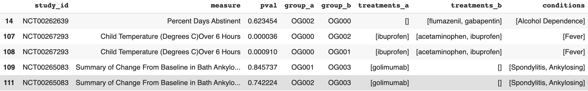

# Treatment Recomendations from Open Source Clinical Trials

I propose an architecture and a basic implementation for treatment recomendations based on clinical trials data from [ClinicalTrials.gov](https://clinicaltrials.gov). The goal is present treatments for a condition, what symptoms they treat, and how effective they are at treating them.

## The Data

[Link to Drive Folder Containing all Created Data](https://drive.google.com/drive/folders/1GQygB0HlN3wP7VDWmgjHDkVp4xxI5-vZ?usp=sharing)

All data comes from the ClinicalTrials.gov website. It is the largest repository of clinical trails in the U.S. and all clinical trials must be posted here by law.

### Structuring a Clincal Trial
The data is a series of clinical trials where each trial is represented as a JSON blob. Working with the data was difficult due to the complexity of a clinical trial. Often times fields were 7 layers into the json strucutre. The best way to work with the data was to create a series of relational tables where each table housed part of clinical trail.

Not all clinical trials were collected. The clinical trials used were intervention trials with target conditions and posted results. This totaled to about 28 thousand studies out of the 300 thousand posted on the website.

**Studies**

- `study_id` A string with the unique NCT medical id of the study
- `name` The the title of the study
- `verified_date` Date study was verified by third party
- `responsible_party` Json string of describing name and type of party responsible for the study
- `conditions` A list of conditions which are the focus of the study
- `type` The type of the study, either interventional, observational or none
- `purpose` Required purpose of study, such as treatment
- `intervention_type` Parallel, crossover, single group, etc.
- `mesh_terms` MEdidical Subject Headers for each one of the studies, represented as a list

**Measures**

- `study_id` A string with the unique NCT medical id of the study
- `measure` The title of the measure
- `type` Primary or Secondary
- `description` Description of the measure as provided by the research group
- `dispersion_param` Parameter detailing the range of the measure. Either NA, 95% Confidence Interval, IQR, SD, or Range
- `measure_param` Type of values the measure is creating, can be mean, median, Least Squares Mean, etc. 
- `units` Units of the measure

**Administrations**

- `study_id` A string with the unique NCT medical id of the study
- `group_id` Id of the group within the study 
- `measure` Title of the measure
- `title` Title of the administration group
- `description` Description of the administration group, typically what treatments are given, how much, and how

**Outcomes**

- `study_id` A string with the unique NCT medical id of the study
- `group_id` Id of the group within the study 
- `measure` Title of the measure
- `title` Title of the outcome or NA if not present
- `value` Value of the outcome in units described by Administrations
- `dispersion` Standard deviation if present
- `upper` upper part of the range if present
- `lower` lower part of the range if present
- `participants` number of participants in the outcome

## Architecture

Assuming data has been parsed as above, the architecture for treatment effectiveness is devided into two steps: preprocessing and runtime.

Preprocessing consists of two main steps. The first is creating the statistics for each outcome. The statistics are created by merging the outcomes, administrations, and measures table then creating a p-value from the outcome values, participants, and ranges in the study. Note that some studies have their own analysis section. I opted not to use it since the p-values are often suspect and can't be recreated with the posted data.

The next step is treatment detection. The interventions of each group are mentioned in the administration description and title. We use a version of BERT to preform NER on the interventions which are then passed through a rules based filter. 

### Treatment Detection

One of the core NLP problems with Clinical Trials analysis is treatment detection. Groups in an intervention trial are given one or more treatments to differentiate them. Some treatments are a placebo meant to act as a baseline. The treatments for each group are detailed in the administration description. There is surprisingly no consistent line items for treatments used in a group, so a model is necessary.

I chose an NER + rules based approach. The NER came from [ClinicalBERT](https://github.com/EmilyAlsentzer/clinicalBERT) which is BERT pre-trained on the PubMed corpus. I then trained BERT on the [BC4CHEMD](https://github.com/cambridgeltl/MTL-Bioinformatics-2016/tree/master/data) chemical NER dataset which labels all chemicals. The corpus is all in a clinical setting. 

| Dataset  | Precision | Recall |  F1  |
-----------|-----------|--------|------|
| BC4CHMED | 93.15 | 90.89 | 92.01|
| ClincalTrials  |  90.5 | 87.4 |   88.9 |

One problem with using NER to detect treatments, is that sometimes treatments are mentioned but not used. An example: `Individuals in this group were given a sugar pill resembling Gabapentin.`

Results of the NER were then passed through some rules-based logic. The logic was comparing the treatments found to the names of the groups. If a treatment was present in a group name, then that treatment was removed from the groups that did not have the treatment in the name. This worked well since many of the group names follow similar naming conventions. 

### The Analytics Table

The purpose of the analytics table is to combine group treatments and outcomes into rows that can be analyzed statistically. It was created first by combining the different group outcomes in a measurement to form a p-value from a students t-test. Then merging in the detecting treatments of a group. An example of the resulting row can be seen below:

Notice the duplicate treatment groups. This is because some of the groups were the same treatment but different dosages. Another model would be necessary to extract the doses.

### Clinical Measures Clustering

A medical condition has many symptoms and methods of detection. Rarely can you pin down a single treatment to cure an entire condition. The complexity of a condition is problematic for the system because a simpel p-value average of all the treatments doesn't make any sense. 

The solution is grouping the measurements and averaging treatments within the group. Clustering was agglomerative and done via cosine similarity. The measurement embeddings were created by SBERT(Sentence-BERT).

#### Fine Tuning SBERT

There were eight measurements chosen for evaluation representing three different measurements: nausea, pain, and intensity of hot flashes. They were chosen because they are all Gabapentin trials, and represent stark differences and similarities. The nausea and pain measures are nearly identical semantically, both using a Visual Analog Score, and hot-flash is very differeny from them both. By default, SBERT perceives almost no difference between different clinical measurments.

To fine tune SBERT we give it pairs of sentences and a 0-1 score representing similarity. I used an interesting aspect of the data to automatically generate the labels. Primary measurments are directly tied to the subject matter of the trial. Since some the trials already have key-word headings, listed conditions, and treatments, we can use that meta-data to generate a score between different primary measurments. The score was a weighted average of the percentage of meta-data shared, with a floor of .85 given to the rare case of two or more primary measurements in the same study. A 60/40 split of high correlating (>.7) and zero correlating measurement pairs were used. The abscence of middle pairs is because of lower confidence in the accuracy of the score away from the extremes. 

|Original| Fine Tuned|
|--------|-----------|
|||

We can see a projection(PCA and TSNE) for the asthma embeddings as well.

Finally some textual data to illustrate some of the clusters. Some of them are well defined:

|Cluster 224|
|-----------|
|A severe exacerbation was defined as a deterioration of asthma requiring: use of systemic corticosteroids for >=3 days; or hospitalization or emergency room visit because of asthma, requiring systemic ...|
|An asthma attack was defined as asthma symptoms during the previous 24 hours requiring one or more of the following: corticosteroid use (systemic), unscheduled visit to the doctor or ...|
|The rate of asthma attacks was defined as the mean number of attacks per participant per year. An asthma attack was defined as a >=20% decrease in AM PEF, a >=70% increase in albuterol use or ....|

|Cluster  31|
|-----------|
|FEV1 is the amount of air, measured in liters, forcibly exhaled in 1 second. Pulmonary function tests were to be performed by participants in the morning before dosing. The percent predicted FEV1 ...|
|PEF is the maximum flow generated during a forceful exhalation, starting from full lung inflation. Participants recorded on diary card the best of three PEF measurements, using a mini-Wright peak flow meter in ...|
|FEV1 is a measure of lung function and is defined as the maximal amount of air that can be forcefully exhaled in one second. Participants were exposed to an allergen 1 hr after dosing on Day 6. Minimum FEV1 over 0-2 hrs post ...|

Others are not so good...

|Cluster 51|
|----------|
|FEV1 is the maximal amount of air forcefully exhaled from the lungs in one second. Spirometry was used for assessment of FEV1. A positive change from Baseline indicates improvement.|
|Forced expiratory flow during the mid (25 - 75%) portion of the FVC. It was assessed by performing spirometric assessment.|
|FEV1 is the volume of air that can forcibly be blown out in one second, after full inspiration. Pooled SDs and LS means were calculated based on an ANOVA model.|

### Aggregation and Results

Results are shown by taking the top ten clusters (by number of studies), averaging the p-values of singular treatments in the clusters, sorting them, and returing the top three treatments for each cluster. Singular treatments referes to the p-value when a treatment is compared to nothing, such as a placebo. Taking the top 10 clusters is done to reduce noise as there is often more than 100 clusters in a condition, many of which are measurements in a single study doing soemthing unrelated. Averaging is done through a simple mean, which is a mistake as this preferences little studied treatments with low p-values over well studied treatments with a range of p-values. 

The results for asthma can be seen below.

Some numbers:

**Cluster 31**

## Future Work

Takeaway: the dataset was very hard. It gave the appearance of being strucutred but every field was inputed by a human and varried wildly. Even simple merging tasks required long regular expressions to get the fields in a state where they can be combined and compared. 

What I should've done...

- Clustered participant criterea, sometimes measurements don't determine a treatment group. The type of pariticipent can also have an effect.
- Extracted dosage from relevant groups
- Trained a different model to extract treatments that wasn't NER, perhaps using NLI. 
- Created a more robust statistics engine then forcing eveything into a student's t-test. About 50% of the measures were lost because they couldn't be worked with. 
- Incorporated the analytics done in the studies. I left them oiut because some were very suspect.
- Aggregated similar conditions based on measurement similarity
- Many more things

